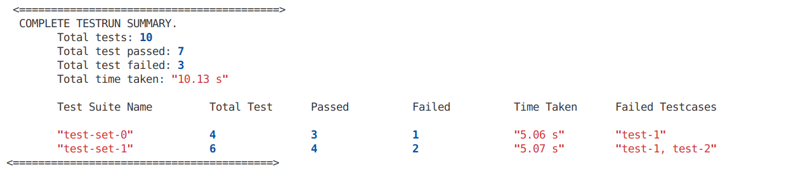

# Perl-MongoDB Quickstart

### Clone
```bash
git clone https://github.com/Akshat005Chaudhary/keploy-perl-mongodb-quickstart.git
cd keploy-perl-mongodb-quickstart
```

### Install Keploy Agent
```bash
curl --silent -O -L https://keploy.io/install.sh && source install.sh
```

## Option 1: Run Locally (MongoDB in Docker)

> This Local setup is Linux first
> App runs locally, DB still in Docker

#### Prerequisites

- Perl installed
- Docker installed
- Keploy installed

### Install cpanm

Ubuntu:
```bash
sudo apt update
sudo apt install cpanminus -y
```
MacOS:
```bash
brew install cpanminus
```
Windows:
```bash
cpan App::cpanminus
```

### Install Dependencies

```bash
cpanm --installdeps .
```

### Start MongoDB
```bash
docker compose up -d mongo
```

### Check Server Health
```bash
perl app.pl daemon -l http://localhost:5000
```
Should say:
```bash
Web application available at http://localhost:5000
```

### Record Tests using Keploy
Before running this command, make sure the server is stopped using `ctrl+C`
```bash
keploy record -c "perl app.pl daemon -l http://localhost:5000"
```


### Testing the APIs (Generate Traffic)

**1. POST /shorten**
```bash
curl -X POST http://localhost:5000/shorten \
  -H "Content-Type: application/json" \
  -d '{"url":"https://keploy.io"}'
```

This will return response:

```bash
{
  "code": "QWERTY",
  "shortUrl": "http://localhost:5000QWERTY"
}
```

**2. Redirect Call**

Suppose the received code is `QWERTY`

```bash
curl -v http://localhost:5000/QWERTY
```

This is return 302 status code and redirect to the original url if code is correct.

```bash
HTTP/1.1 302 Found
Location: https://keploy.io
```

**3. Check Stats**
```bash
curl http://localhost:5000/stats/QWERTY
```

This will return the stats of the short url.

```bash
{
  "clicks": 1,
  "code": "QWERTY",
  "createdAt": "2026-01-30T06:47:03Z",
  "originalUrl": "https://keploy.io"
}
```

**4. Negative Case**
```bash
curl http://localhost:5000/XXXXXX
```

This is give error:

```bash
{
  "error": "Short URL code not found"
}
```

Now stop recording with `ctrl+C`

### Replay Tests using Keploy
```bash
keploy test -c "perl app.pl daemon -l http://localhost:5000"
```



10 Test cases were generated and 7 passed while 3 failed. This is not a bug with keploy but infact shows how robust keploy is with testing our applications and API. The `/shorten` endpoint returns a different random short code each run. While our short code generator is non-deterministic (random string).

> Your number of test cases may vary from mine based on the traffic you generate.

---

## Option 2: With Docker

#### Prerequisite

- Docker
- Keploy

### Run with Docker

When running with Docker Compose, the app must connect to MongoDB using mongo as hostname, not localhost.

```bash
keploy record -c "docker compose up" --container-name=perl-app
```

### Testing the APIs (Generate Traffic)

You can run the same curl commands as above.

### Replay Command

Do not forget to stop with record server first.

```bash
keploy test -c "docker compose up" --container-name=perl-app --delay 10
```

